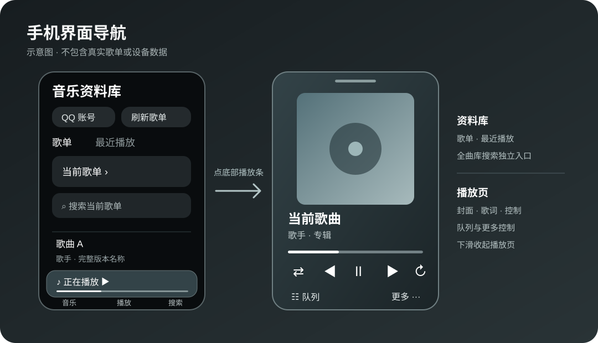

# Sonos QQ 音乐控制台

在 macOS 上运行的本地网页控制台。它通过 Sonos 的局域网接口读取播放状态、控制播放，并读取 QQ 音乐账号的自建歌单、收藏歌单及“我喜欢”。




> 上图是功能布局示意，不包含真实账号、歌单或设备信息。

**快速开始：**安装 Node.js 20+，确认 Mac 与 Sonos 在同一局域网，在 Sonos App 中添加 QQ 音乐服务，然后按下文的[本地运行](#本地运行)启动服务。首次打开网页后，从“QQ 账号”登录，再选择歌单点播。

## 功能

- 播放、暂停、上一首、下一首、随机播放、单曲循环、整队循环、淡入淡出、静音和音量控制；循环模式可与随机播放组合
- 播放进度每秒更新，并定期向 Sonos 校准；可拖动进度，拖动音量时即时同步到 Sonos
- 播放、暂停、切歌、歌单点播和队列点播采用统一状态同步：界面先即时反馈，再等待 Sonos 连续稳定回报，避免过渡状态显示为暂停或 0:00
- 查看 Sonos 当前播放队列，按正在播放的位置定位、翻页、点播，以及逐首上移、下移或移除
- 歌单及搜索结果可将歌曲设为下一首，或加入队列末尾
- 选择 Sonos 房间、组合或拆分房间，调节单个房间及分组音量
- 睡眠定时：设置多少分钟后停止，或在指定时间停止；定时保存在 Sonos 中，关闭网页后仍然有效
- QQ 音乐“我喜欢”、自建与收藏歌单：切换歌单、在歌单内直接搜索、整行点播、向下滚动自动加载更多；“搜索全曲库”使用独立入口，点播后保持搜索面板打开
- 首次点击歌单歌曲会替换 Sonos 当前队列：先播放所选歌曲，再在后台按歌单顺序补齐其余曲目。再次点播已入队的歌曲直接切换；尚未入队的歌曲优先播放并重新补齐队列。正常导入时不显示进度消息，失败时提示原因。全曲库搜索结果按单曲点播处理
- 可添加多个 QQ 音乐网页登录状态，并从主页的“QQ 账号”二级菜单切换；网页登录用于显示歌单，音箱播放使用 Sonos 中配置的 QQ 音乐账号
- 在“当前歌单”卡片中打开可搜索的歌单列表；每个 QQ 账号会记住自己上次选中的歌单，重新打开网页或重启服务后继续显示该歌单
- “最近播放”记录通过本网页从歌单或全曲库成功发起的点播，每个网页 QQ 账号最多保留 100 首；可再次点播或清空。记录仅保存在本机，不会读取 QQ 音乐 App 或 Sonos App 的历史
- 专辑封面、逐行歌词和歌词面板；从 QQ 音乐播放歌词接口请求逐行翻译，原文与译文同步显示，没有译文时只显示原文。Sonos 队列缺少歌曲信息时，用 QQ 歌单补全标题、歌手、时长与封面
- 电脑端滚过主播放器后显示顶部控制工具栏；手机端底部导航只保留“音乐”和“搜索”，从音乐页的精简播放条进入完整播放页，向下滑动返回。精简播放条显示歌曲播放进度，音量在完整播放页中调节
- QQ 音乐扫码登录；登录过期时可重新登录或导入本机浏览器 Cookie
- macOS `launchd` 开机后自动运行的配置模板

## 最近更新

- 手机底部导航精简为“音乐 / 搜索”；点击精简播放条进入完整播放页。歌词页支持原文与 QQ 音乐逐行译文同步显示，例如 QQ 音乐提供翻译的英文歌曲
- 播放器改为从封面提取主色并应用到全页渐变；补全封面与逐行歌词展示
- 重新设计桌面与移动端播放控制，使用一致的图标、按压反馈和焦点处理；修复 iOS Safari 的残留高亮
- 将播放队列、睡眠定时、整队循环、淡入淡出和房间分组加入界面；不常用控制收进“更多控制”菜单
- 搜索、歌词、队列和操作菜单均支持点击遮罩关闭，并适配 iPhone Safari 的可视区域和底部安全区域
- 歌单支持自动加载更多、悬浮搜索和回到顶部；队列支持分页、点播和逐首调整
- 服务端增加队列、睡眠定时、房间拓扑和播放模式接口，并在 Sonos 缺少元数据时补全 QQ 音乐的歌曲信息
- 统一播放状态同步，覆盖播放、暂停、切歌、歌单点播、队列点播和进度拖动，避免 Sonos 过渡状态造成图标或进度滞后
- 暂停时切换上一首或下一首会直接开始播放；网页书签与页眉使用黑底白字图标
- 资料库改为“歌单 / 最近播放”两个页面内入口，手机上收紧封面区域，让歌曲列表更容易到达
- 手机界面按 Sonos App 的信息层级重排：资料库先显示，完整播放页一屏容纳常用控制，全曲库搜索独立成页，曲目操作从底部展开；歌单与搜索结果显示可用的专辑封面
- 手机可从底部精简播放条上滑打开完整播放页，从播放页向下滑动收起；播放页跟随手指移动，并为弹窗、列表切换及专辑配色变化加入过渡，系统选择“减少动态效果”时停用动画
- 歌词页使用封面色背景和逐行渐隐效果；手机上的队列、更多控制、账号、歌单、定时、房间和曲目操作统一为可下滑关闭的底部面板，关闭按钮与安全区间距保持一致
- 歌单后台导入改为静默执行；只有导入失败时才弹出一次错误提示，减少资料库页面的提示噪声
- 使用 QQ 音乐返回的完整标题，区分“十面埋伏”与“十面埋伏 (Live)”等不同版本
- 同一歌单重复点播时复用已入队歌曲；后台导入中选择未入队歌曲，会中止旧任务并优先播放新歌

## 要求

- macOS
- Node.js 20 或更高版本
- Mac 与 Sonos 位于同一局域网
- Sonos 中已添加可播放的 QQ 音乐账号；首次使用前，Sonos 收藏或播放队列中需有一项 QQ 音乐内容，供本地服务识别 Sonos 的账号参数

## 本地运行

先在 Sonos App 的音箱信息中查看 Sonos 的局域网 IP，或从路由器的设备列表中查看。将下面的占位符替换为该地址，在终端执行：

```sh
git clone git@github.com:knightyui/SonosWebControl.git
cd SonosWebControl/web
SONOS_IP=你的_Sonos_IP npm start
```

如果尚未配置 GitHub SSH，也可以用 `git clone https://github.com/knightyui/SonosWebControl.git`。项目没有第三方 npm 依赖，`npm start` 会直接调用已安装的 Node.js。保持终端打开，按 `Control-C` 可停止前台服务。

默认端口是 `38473`。浏览器打开：

```text
http://localhost:38473
```

需要换端口时，在启动命令中设置 `PORT`：

```sh
SONOS_IP=你的_Sonos_IP PORT=38473 npm start
```

同一局域网的设备可使用 Mac 的局域网地址访问该端口。请只在可信局域网中使用，不要将此服务暴露到公网。

## 日常使用

1. 在 Mac 上启动服务，手机与 Mac、Sonos 接入同一局域网。手机 Safari 打开 `http://Mac的局域网IP:38473`；Mac 浏览器使用 `http://localhost:38473`。
2. 首次使用时从“QQ 账号”扫码登录。资料库可选择“我喜欢”、自建或收藏歌单；点击“当前歌单”切换歌单，用歌单内搜索缩小列表，或从底部“搜索”查找 QQ 音乐全曲库。
3. 点击歌单曲目开始播放。首次点播会以该歌单替换 Sonos 队列，并在后台补齐后续曲目；重复点播已入队歌曲会直接切换。列表右侧的“···”可安排下一首播放或加入队列末尾。
4. 点击手机底部精简播放条进入完整播放页，可调整播放进度和音量、查看歌词、打开队列及更多控制。向下滑动播放页返回资料库；队列和更多控制面板也可下滑关闭。
5. 如需切换网页用于浏览歌单的 QQ 账号，打开“QQ 账号”菜单。音箱实际播放仍由 Sonos App 中配置的 QQ 音乐账号负责。

下图概括网页账号与音箱账号各自的作用；它们可以不同，但音箱账号必须具有目标歌曲的播放权限。


## QQ 音乐登录

在运行服务的 Mac 上打开网页，进入“QQ 账号”菜单，点击“登录 QQ 音乐”或“添加或重新登录”并扫码。多个网页登录状态保存在本机的 `web/.qq-session.json`，旧版单账号文件会自动兼容读取。该文件已被 Git 忽略，不能提交或分享。手机网页可切换已保存的账号，也可在同一局域网内扫码添加账号；如果只有一个已保存账号，须先添加第二个账号才能切换。Cookie 导入仅允许在 Mac 本机通过 localhost 完成。

网页 QQ 账号只用于读取该账号的歌单、搜索和补全资料。歌曲地址加入 Sonos 队列后，音频由 Sonos 使用其已添加的 QQ 音乐服务账号获取。网页切换到其他 QQ 账号不会把该账号登录到 Sonos；若 Sonos 的账号没有对应歌曲的播放权限，页面会在点播失败或音箱未进入播放状态时提示检查账号、会员权限或版权限制。QQ 音乐全曲库搜索目前显示前 30 条相关歌曲，可直接点播或加入队列。

首次从歌单点播会清空 Sonos 原队列，所点歌曲立即播放，其余曲目在后台静默加入。再次点播同一歌单中已入队的歌曲会直接切换，不重复导入；若新歌曲尚未入队，会取消旧导入任务，让新歌先播放，再从它开始补齐队列。导入期间仍暂时禁止其他队列编辑。导入完成后队列按歌单原顺序排列，播放位置对应所点歌曲。原有随机播放模式会在导入完成后恢复；开启随机播放时，Sonos 队列界面可能显示随机顺序。若导入失败，页面会弹出一次包含已加入曲目数和原因的提示，可再次点播重建队列。大歌单导入需要较长时间，期间不要重启本地服务。

播放新歌时优先沿用 Sonos 当前 QQ 音乐曲目的账号；当前曲目不是 QQ 音乐时，再查队列和收藏中的 QQ 账号参数。因此如果 Sonos 添加了多个 QQ 账号，先在 Sonos App 中播放一首目标会员账号的歌曲，再从网页点播。随机播放开启时，网页会在入队后重新查询歌曲的实际队列位置，避免 Sonos 返回的入队位置与播放位置不一致。

如果页面提示找不到 Sonos 的 QQ 音乐播放账号，先在 Sonos App 中播放一首 QQ 音乐歌曲，或将任意 QQ 音乐歌单加入 Sonos 收藏。网页会从 Sonos 内容中识别账号参数；无需将网页正在查看的歌单逐个收藏到 Sonos。

如扫码登录暂时不可用，可在网页登录 QQ 音乐后，从浏览器请求中复制 Cookie，再通过页面中的备用入口导入。Cookie 属于登录凭据，只应保存在自己的设备上。

## 播放队列与更多控制

在播放器中点击“播放队列”可查看 Sonos 当前队列；默认定位到正在播放歌曲所在页。点击队列中的歌曲即可播放，前后翻页可浏览长队列。

每首歌右侧的“···”可将歌单歌曲加入下一首或队列末尾，也可调整队列中曲目的顺序或移除曲目。随机播放由 Sonos 管理，开启时队列的显示次序可能随设备重新排序；如果队列在操作间发生变化，页面会要求刷新，避免按过期位置操作其他歌曲。

“整队循环”与“淡入淡出”由 Sonos 保存。点击“房间”可切换当前控制的房间，并将其他独立房间加入当前分组或移出分组；分组音量仅在发现多个房间且处于同组时出现。房间发现依赖同一 Sonos 家庭的拓扑信息。当前开发环境只发现一个房间，因此多房间分组操作尚需在有多台 Sonos 的环境验证。

主播放器只保留“播放队列”和“更多控制”。睡眠定时、整队循环、淡入淡出和房间控制收在“更多控制”菜单里。弹窗可点击遮罩关闭；手机上的底部面板还可下滑关闭。搜索页会跟随 iPhone Safari 键盘打开后的可视区域定位，避免被键盘遮挡。

点击“睡眠定时”可输入分钟数，或选择本机浏览器时间中的停止时刻。若所选时刻今天已过，则使用明天的同一时刻。页面可显示 Sonos 当前定时和剩余时间，也可取消定时。

## 配置为开机自动运行

模板位于 [deploy/com.sonos-web.plist.example](deploy/com.sonos-web.plist.example)。在项目根目录执行以下命令，将模板复制到用户级服务目录：

```sh
mkdir -p ~/Library/LaunchAgents
cp deploy/com.sonos-web.plist.example ~/Library/LaunchAgents/com.sonos-web.plist
command -v node
pwd
```

用文本编辑器打开 `~/Library/LaunchAgents/com.sonos-web.plist`，把下面三个占位符替换为本机的实际值。`command -v node` 给出 Node 路径，`pwd` 给出项目绝对路径；保存后再加载服务。

| 占位符 | 示例值 | 说明 |
| --- | --- | --- |
| `{{NODE_BIN}}` | `/opt/homebrew/bin/node` | `command -v node` 的输出 |
| `{{PROJECT_DIR}}` | `/Users/your-name/SonosWebControl` | 本项目的绝对路径 |
| `{{SONOS_IP}}` | `192.168.x.x` | Sonos 在局域网中的 IP |

保存配置后，加载并启动服务：

```sh
launchctl bootstrap gui/$(id -u) ~/Library/LaunchAgents/com.sonos-web.plist
launchctl kickstart -k gui/$(id -u)/com.sonos-web
```

查看状态；输出应包含 `state = running`：

```sh
launchctl print gui/$(id -u)/com.sonos-web
```

### 重启服务

**通过终端前台运行时：**在原终端按 `Control-C`，再进入 `web` 目录，使用原来的 `SONOS_IP` 和 `PORT` 重新执行 `npm start`。不要同时运行前台进程和 `launchd` 服务，否则端口会被占用。

**通过 `launchd` 自动运行时：**

1. 先确认大歌单的后台导入已经结束；重启会中断尚未完成的导入。可以在网页中等待队列曲目数稳定，或查看 `http://localhost:38473/api/queue/import`，确认 `import` 为 `null` 或 `phase` 为 `complete`。
2. 在终端设置实际使用的配置路径。以下是本仓库模板对应的默认路径；如果你安装时改过文件名，请填写自己的实际路径。

   ```sh
   plist_path="$HOME/Library/LaunchAgents/com.sonos-web.plist"
   ls -l "$plist_path"
   service_label=$(/usr/libexec/PlistBuddy -c 'Print :Label' "$plist_path")
   echo "$service_label"
   ```

3. 用配置中的真实 `Label` 重启服务，再检查状态和网页是否响应：

   ```sh
   launchctl kickstart -k "gui/$(id -u)/$service_label"
   launchctl print "gui/$(id -u)/$service_label" | head -20
   curl -fsS -o /dev/null -w '%{http_code}\n' http://localhost:38473/
   ```

   `curl` 输出 `200` 表示网页服务已启动。如果自定义了 `PORT`，把上面的 `38473` 换成实际端口；手机浏览器随后刷新页面。

4. 如果启动失败，检查服务日志。模板默认写入项目 `web` 目录中的以下文件（已被 Git 忽略）：

   ```sh
   tail -n 50 web/.server.stderr.log
   tail -n 50 web/.server.stdout.log
   ```

修改了 `plist` 的启动路径、环境变量或端口后，单独执行 `kickstart` 不会重新读取配置。先运行 `launchctl bootout gui/$(id -u) "$plist_path"`，再运行 `launchctl bootstrap gui/$(id -u) "$plist_path"`，然后按上述步骤检查状态。

### 停用服务

不再需要自动运行时，停用服务：

```sh
launchctl bootout gui/$(id -u) ~/Library/LaunchAgents/com.sonos-web.plist
```

如果这台 Mac 之前用其他文件名或 `Label` 安装过服务，请先用旧配置的实际路径停用旧服务，再加载新模板，以免两个进程同时占用端口。修改已有部署时，也应先查看 `~/Library/LaunchAgents/` 中实际使用的 `plist`；上述命令中的名称只对应本仓库模板。删除服务时，先执行 `bootout`，再删除对应的 `plist`。升级代码时保留 `web/.qq-session.json`，否则需要重新登录 QQ 音乐。

## 项目结构

```text
web/
  public/             网页界面
  server.mjs          Sonos 与 QQ 音乐接口
  qq-session.mjs      本机 QQ 登录会话处理
  play-history.mjs    本机最近播放记录
  package.json        Node.js 启动脚本
deploy/
  com.sonos-web.plist.example  launchd 配置模板
docs/
  interface.svg       手机界面入口示意
  playback-flow.svg   网页账号与 Sonos 播放关系
```

网页书签与页眉使用简洁的黑底白字“S”图标，保存在 `web/public/favicon.svg`，由本地服务提供。

## 上传到 GitHub 前的检查

项目根目录的 `.gitignore` 已排除登录会话、本机播放记录、日志、环境变量文件、实际 `plist` 配置、依赖目录和 Finder 元数据。上传前可执行：

```sh
git status --short
git ls-files web/.qq-session.json web/.play-history.json '*.log' '*.plist' '.env*'
```

第二条命令应没有输出。确认暂存列表中也没有登录会话、日志、环境变量或包含个人路径和设备地址的实际配置文件，再提交或推送。

## 注意事项

- QQ 音乐网页接口并非公开 API，可能随服务变动而失效。
- 本项目不保存 QQ 密码或音频文件；Cookie 登录会话只保存在本机。
- 任何可访问此网页服务的人都能控制对应的 Sonos，因此不要对公网开放端口。
